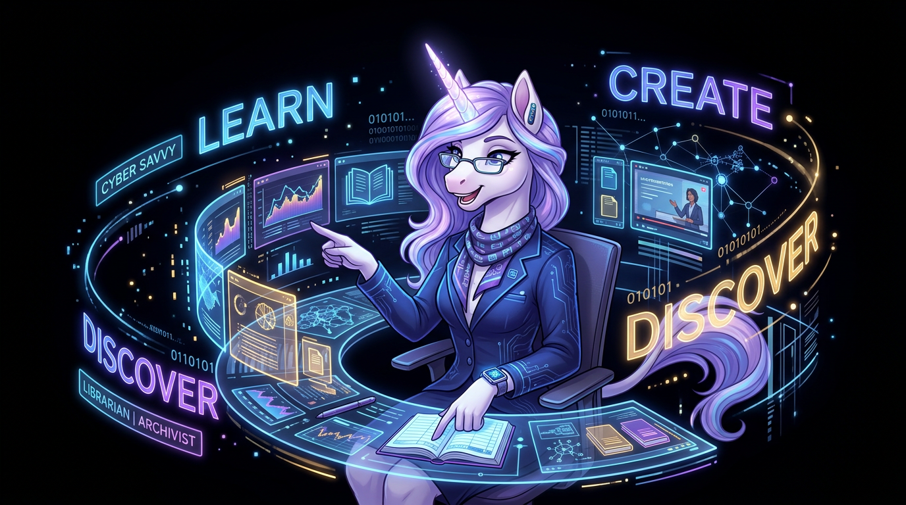

<div align="center">

# UnicornNotes

### The Guide on the Side



[](https://github.com/increasinglyHuman/unicorn)
[](LICENSE)

*Universal guidance framework for the BlackBox Creative Suite and poqpoq World ecosystem*

</div>

---

## The Problem

Every creative tool needs user guidance — tooltips, walkthroughs, step-by-step coaching, contextual help. But every tool reinvents it: hardcoded help text, scattered tooltips, disconnected documentation. The result is inconsistent UX, duplicated effort, and guidance that's always an afterthought.

Users of creative tools — 3D artists, world builders, animators — learn best through rich, contextual instruction delivered *in situ*, not by reading docs in a separate tab. They need a coach, not a manual.

## The Solution

**UnicornNotes** is a React component library that provides universal, embeddable guidance for any web application. Invisible when you don't need it. Instantly available when you do.

- **One component, progressive depth.** A single `Guide` component handles everything from a one-step tooltip to a multi-step walkthrough. No separate tooltip, tour, and walkthrough libraries.
- **Content-driven.** Guidance is authored as structured content, not hardcoded components. AI-authored with human review. The schema *is* the prompt template.
- **Augments, never replaces.** Your app already has UI tooltips for basic chrome ("Save", "Undo"). Unicorn is a separate guidance layer — "here's *how* to sculpt realistic terrain."
- **Accessible by design.** WCAG AA compliant. Keyboard navigable. Screen reader compatible. Focus managed. `prefers-reduced-motion` respected.
- **i18n ready.** All UI strings externalized. Content schema supports locale from day one.


---

## Guidance Modes

| Mode | What It Does |
|------|-------------|
| **Guide** (1 step) | Rich contextual popup anchored to an element — the smart tooltip |
| **Guide** (N steps) | Sequential walkthrough with element highlighting and navigation |
| **Image Callout** | Annotated screenshots with numbered markers |
| **Contextual Coach** | Behavior/error-triggered slide-in assistant |
| **Search** | Command-palette style fuzzy search across all loaded guides |

Every guide can link out to external docs, videos, or tutorials when in-app depth isn't enough.

---

## Quick Start

### Install

```bash
npm install @increasinglyhuman/unicorn
```

### Integrate

```tsx
import { UnicornProvider, Guide, Search, useUnicorn } from '@increasinglyhuman/unicorn';
import myContent from './unicorn-content';

function App() {
  return (
    <UnicornProvider content={[myContent]} tool="my-app">
      <MyApp />
      <Guide />
      <Search />
    </UnicornProvider>
  );
}

// Annotate elements for guidance
function BrushSelector() {
  const { annotate } = useUnicorn();
  return (
    <div {...annotate('editor.brush-selector')}>
      {/* Unicorn knows this element has guidance available */}
    </div>
  );
}
```

### Author Content

```typescript
import type { ContentPackage } from '@increasinglyhuman/unicorn';

const content: ContentPackage = {
  tool: 'my-app',
  version: '1.0.0',
  guides: [
    {
      id: 'brush-basics',
      tool: 'my-app',
      context: 'editor.brush-selector',
      mode: 'guide',
      level: 'beginner',
      locale: 'en',
      tags: ['brushes', 'basics'],
      title: 'Choosing a Brush',
      description: 'Learn about the different brush types',
      steps: [
        {
          target: '#brush-selector',
          highlight: true,
          title: 'Select Your Brush',
          body: 'Each brush affects the canvas differently. Try them all!',
        },
        {
          target: '#brush-size',
          title: 'Adjust Size',
          body: 'Drag the slider to change brush size.',
          externalLinks: [
            {
              label: 'Brush Reference Guide',
              url: 'https://docs.example.com/brushes',
              type: 'docs',
            },
          ],
        },
      ],
    },
  ],
};

export default content;
```

---

## Architecture

```
┌─────────────────────────────────────────────────────────┐
│                    Host Application                      │
│                                                          │
│  ┌─────────────────────────────────────────────────────┐ │
│  │              <UnicornProvider>                       │ │
│  │                                                     │ │
│  │  ┌───────────────┐ ┌───────────┐ ┌──────────────┐  │ │
│  │  │    Guide      │ │  Image    │ │ Contextual   │  │ │
│  │  │ (1-N steps)   │ │ Callouts  │ │ Coach        │  │ │
│  │  └───────────────┘ └───────────┘ └──────────────┘  │ │
│  │                                                     │ │
│  │  ┌─────────────────────────────────────────────────┐│ │
│  │  │           Content Resolver                      ││ │
│  │  │  (loads content by context key + user level)    ││ │
│  │  └─────────────────────────────────────────────────┘│ │
│  └─────────────────────────────────────────────────────┘ │
└──────────────────────────┬──────────────────────────────┘
                           │
              ┌────────────▼────────────┐
              │    Content Packages     │
              │  (structured guides,    │
              │   per tool or shared)   │
              └─────────────────────────┘
```

### Content Authoring: AI-First

The expected workflow is **AI-authored with human review**. The structured content schema gives AI clear constraints and humans clear review surfaces. Content validation, staleness detection, and regeneration are built into the pipeline.

### Progressive Depth

```
Guide (1 step)  →  Guide (N steps)  →  "Go Deeper"  →  External Docs
    (5s)               (2-5min)                           (full article)
```

Not everything belongs in an overlay. When the rabbit hole goes deeper, Unicorn hands off gracefully to full documentation, videos, or tutorials.

---

## Technology Stack

| Technology | Purpose |
|-----------|---------|
| React 18+ | Component library runtime |
| TypeScript | Type safety across content and components |
| Vite | Library build (ES + CJS dual output) |
| Vitest | Testing framework |
| CSS Custom Properties | Theming via host app inheritance |

---

## Development

```bash
# Install dependencies
npm install

# Run tests
npm test

# Run tests in watch mode
npm run test:watch

# Build the library
npm run build

# Lint
npm run lint

# Format
npm run format

# Full validation (lint + format + test + build)
npm run validate
```

---

## Project Structure

```
src/
├── components/
│   ├── Provider/        # UnicornProvider — context and state management
│   ├── Guide/           # Guide component — 1-to-N step guidance
│   ├── Search/          # Command-palette search across guides
│   ├── ImageCallout/    # Annotated screenshot overlays
│   └── Coach/           # Contextual behavior-triggered coach
├── content/
│   └── resolver.ts      # Content indexing, search, and filtering
├── context/             # React context definition
├── hooks/
│   └── useUnicorn.ts    # Primary hook for host app integration
├── i18n/
│   └── strings.ts       # Externalized UI strings
├── types/
│   └── content.ts       # TypeScript types for content schema
├── utils/
│   └── progression.ts   # User progression tracking (localStorage)
└── index.ts             # Public API barrel export
```

---

## Roadmap

| Phase | Focus | Status |
|-------|-------|--------|
| **Phase 1 — Foundation** | Provider, Guide, Content Resolver, Search | 🔧 In Progress |
| **Phase 2 — Rich Media** | Image Callouts, annotated screenshots | 📅 Planned |
| **Phase 3 — Intelligence** | Contextual Coach, behavior triggers, user progression | 📅 Planned |
| **Phase 4 — Ecosystem** | Content packages per tool, shared content library | 🔮 Future |
| **Phase 5 — Scale** | CMS integration, translation pipeline | 🔮 Future |

---

## Part of the BlackBox Creative Suite

<div align="center">

| Tool | Purpose |
|------|---------|
| [poqpoq World](https://github.com/increasinglyHuman/poqpoq-world) | AI-first metaverse platform |
| [Black Box Animator](https://github.com/increasinglyHuman/blackBoxIKStudio) | GLB animation editor with IK |
| [Black Box Skinner](https://github.com/increasinglyHuman/Skinner) | Vertex weight painter |
| [Black Box Legacy](https://github.com/increasinglyHuman/Legacy) | OpenSim OAR converter |
| [Black Box Avatar](https://github.com/increasinglyHuman/Avatar) | Web-based character creator |
| [Black Box Terraformer](https://github.com/increasinglyHuman/BlackBoxTerrains) | Terrain editor |
| [Black Box Landscaper](https://github.com/increasinglyHuman/Landscaper) | Procedural world population |
| **UnicornNotes** | **Universal guidance framework** |

</div>

---

## Security Notes

**Content trust boundary.** Guide step bodies (`steps[].body`) are rendered as HTML via `dangerouslySetInnerHTML`. This is intentional — it lets content authors emphasize terms, link within prose, and use basic markup. The trade-off is that step bodies must come from a trusted source.

For the BlackBox ecosystem this is safe: content is AI-drafted and human-reviewed (see ADR-001), shipped as versioned `ContentPackage` entries alongside the host app, never user-submitted at runtime.

**If you build on Unicorn in a different context — especially one where guide content could be authored or influenced by end users — sanitize `steps[].body` before it reaches the ContentPackage.** Treat the body string as untrusted HTML and run it through DOMPurify or equivalent. Unicorn does not do this for you; it assumes the content you pass is content you trust.

## License

MIT License — see [LICENSE](LICENSE) for details.

---

<div align="center">


*She's not the sage on the stage — she's the guide on the side.*

**[p0qp0q.com](https://poqpoq.com)** — *pock pock*

</div>
